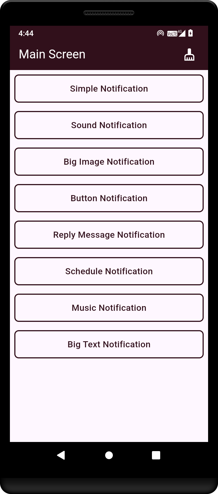
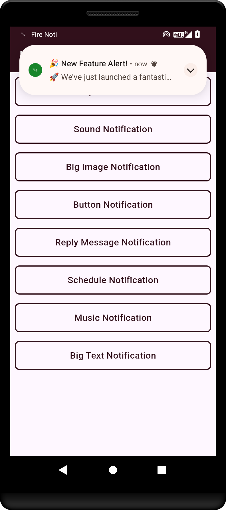
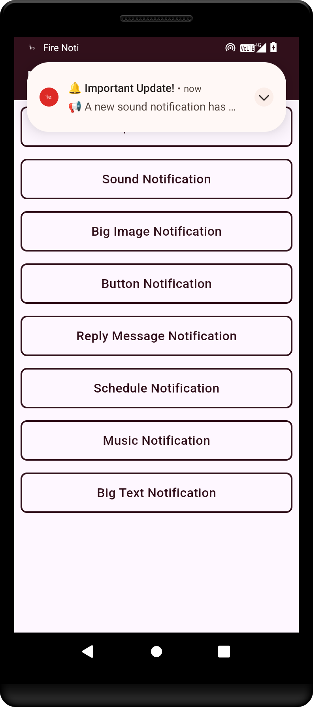
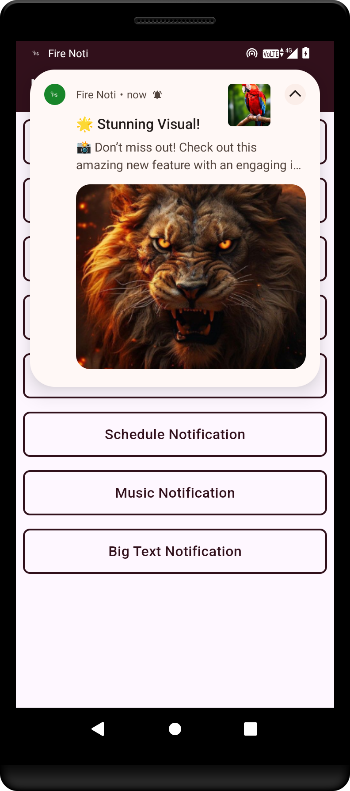
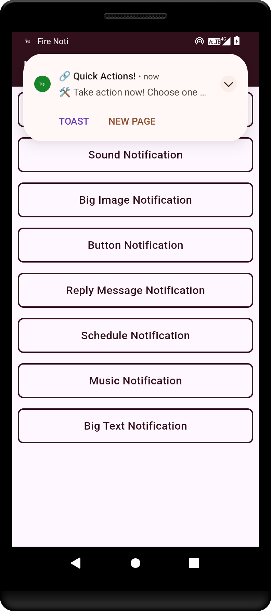
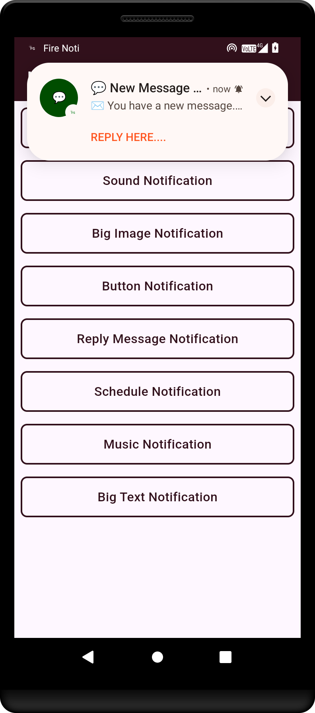
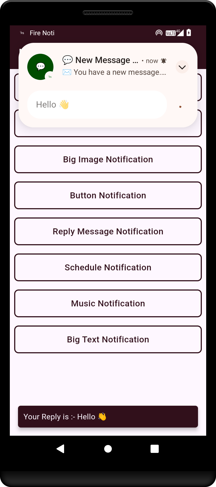
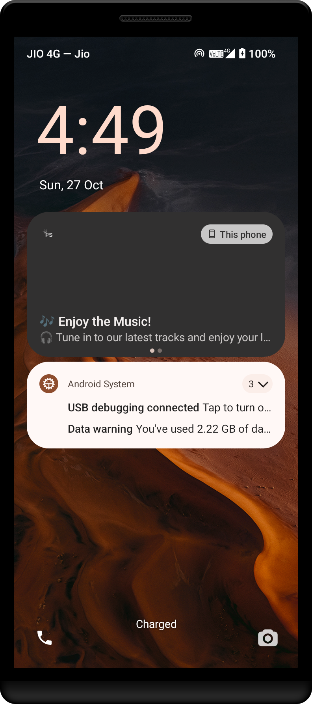
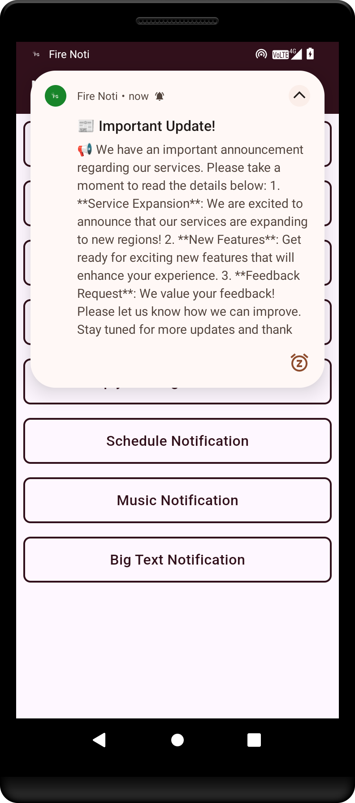

# FireNoti

FireNoti is a Flutter-based mobile application that leverages Firebase Cloud Messaging (FCM) for sending and managing push notifications. This project aims to provide a seamless notification experience by integrating Firebase FCM, enabling real-time alerts and updates for users.

## Features

- **Firebase FCM Integration**: Uses Firebase Cloud Messaging for sending push notifications.
- **Real-Time Notifications**: Receive instant alerts and updates directly on your mobile device.
- **Customizable Alerts**: Allows easy customization of notification content and appearance.
- **Efficient Message Delivery**: Ensures reliable and timely notification delivery.
- **User Engagement**: Boosts user engagement with interactive notifications.

# Fire-Noti Project Contribution Acknowledgement

<p align="left">
  
</p>

We would like to acknowledge the valuable contributions made by **Imran** to the Fire-Noti project.

## Updates by Imran

- **iOS Project Configuration and Assets**
  - Added CocoaPods support by creating a `Podfile` and including necessary configurations in `Debug.xcconfig` and `Release.xcconfig`.
  - Updated `Runner.xcodeproj` to include Pods frameworks and configurations.
  - Added new app icon images to `Assets.xcassets` and updated `Contents.json` for proper asset management.
  - Modified `Info.plist` to include user tracking usage description and background modes for notifications.
  - Refactored `NotificationCalendar` class to allow mutable properties: year, month, day, hour, minute, second, and millisecond.

Thank you, Imran, for your dedication and excellent work on improving the Fire-Noti project!


## Getting Started

### Prerequisites

Before you begin, ensure you have met the following requirements:
- [firebase_core](https://pub.dev/packages/firebase_core): For integrating Firebase with the Flutter app.
- [firebase_messaging](https://pub.dev/packages/firebase_messaging): For Firebase Cloud Messaging (FCM) support.
- [awesome_notifications](https://pub.dev/packages/awesome_notifications): For displaying customizable local and push notifications.

Add these dependencies to your `pubspec.yaml` file:

```yaml
dependencies:
  flutter:
    sdk: flutter
  firebase_core: ^3.6.0
  firebase_messaging: ^15.1.3
  awesome_notifications: ^0.10.0
```
### Installation

1. **Clone the repository:**
   ```bash
   git clone https://github.com/Puneetsharma5525/Fire-Noti.git
   cd FireNoti
### Android Output

<p>This is the main screen of the Flutter application, showcasing the primary user interface.</p>


<p>Example of a simple notification that alerts the user to a new message or event.</p>


<p>Demonstration of a notification with sound, enhancing user engagement through audio cues.</p>


<p>An example of a big image notification.</p>


<p>Illustration of a notification featuring action buttons, allowing users to respond directly from the notification.</p>


<p>This shows a reply notification, enabling users to quickly respond to messages without opening the app.</p>


<p>Example of a chat message notification, indicating new messages from contacts.</p>


<p>Music notification showing playback controls and information about the currently playing track.</p>


<p>A big text notification that provides detailed information and context to the user.</p>
